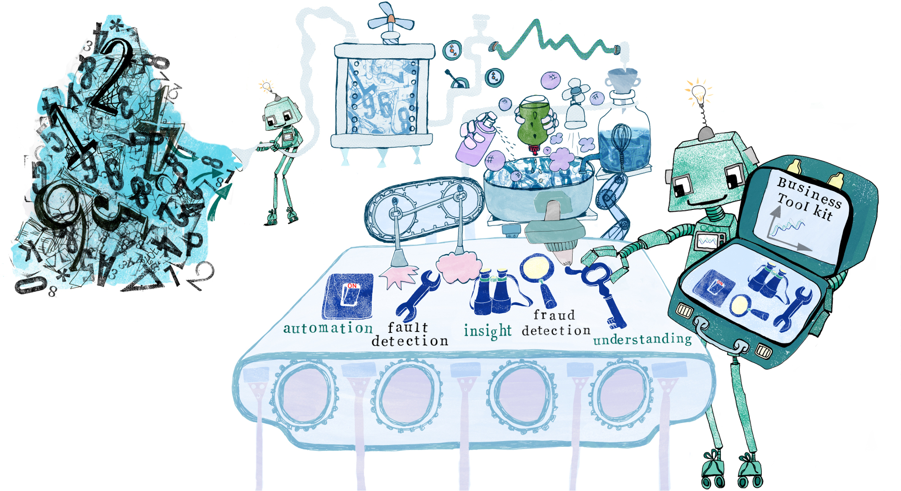
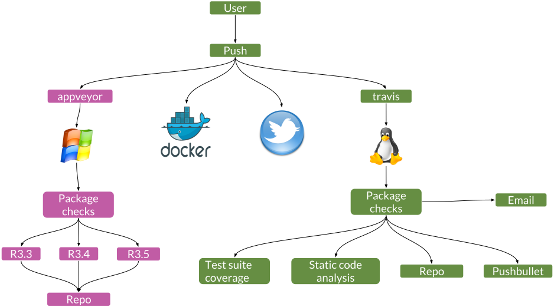

```{r setup, include=FALSE, message=FALSE}
options(htmltools.dir.version = FALSE)
library("jrPresentation")
set_presentation_options()
```

layout: true
`r add_border(inverse=FALSE)`
---

# Material

  * HTML slides: https://jumpingrivers.com/t/2018-erum-github/

  * GitHub organisation: https://github.com/erum2018-talk/
  
    - A dummy R package used in this talk (`erum2018/`)
    
    - Markdown documents (`slides/`)
    
    - Drat repository (`drat/`)
  
  * This talk uses git and GitHub
    
  * Appropriate credits are the end

---

# We all use packages (don't we?)

--

  * Version numbers

--

  * Enforces documentation

--

    - But it can't force us to write good documentation!

--

  * __Automatic code checking__
  
    - R CMD check my_amazing_pkg.tar.gz
    
    - R CMD check --as-cran my_amazing_pkg.tar.gz

---

# We all use version control (don't we?)

--

We get to avoid

  * thesis.R
    
  * thesis1a.R
    
  * thesis1a_final.R

--

  * thesis1a_final_I_hate_my_degree.R

--

It (allegedly) makes it easier to merge documents

> Generally "a good thing"


---

# Data science workflow

```{r echo=FALSE, out.width="100%"}

```
---

layout: true
`r add_border(inverse=TRUE)`

---
class: inverse, middle, center
background-image: url(assets/white_logo.png)

# Automate whenever possible

---

layout: true
`r add_border(inverse=FALSE)`

---

# The trouble with code is...

.pull-left[
  * I don't trust myself to write good code 100% of the time

  * Solution: Check my (pushed) commits!
]

.pull-right[
```{r, echo = FALSE, out.width="90%"}

```
]

---

background-image: url(graphics/travis-op.png)
 
# Travis CI [](https://travis-ci.org/eRum2018-talk/erum2018)


> Travis CI is a hosted, distributed continuous integration service 
> used to build and test software projects hosted at GitHub

--

You push, travis checks you haven't done something silly

---

# Add .travis.yml to your repo  [](https://travis-ci.org/eRum2018-talk/erum2018)

```
language: r
cache: packages
```
--
```
r:
  - release
  - oldrel
  - devel
```
--
```
notifications:
  email:
    on_success: change
    on_failure: change
```
--

> Authorise at [travis-ci.org](https://travis-ci.org/)

---

layout: true
`r add_border(inverse=TRUE)`

---

class: inverse, middle, center
background-image: url(assets/white_logo.png)

# Anything else?

---

layout: true
`r add_border(inverse=FALSE)`

---

# Test suite code coverage [](https://codecov.io/gh/eRum2018-talk/erum2018)

You can add unit tests to your package:

  - specific inputs, give outputs
  
  - expected errors
  
  - fix a bug, add a test 

--

```
# .travis.yml
r_packages:
  - covr
```
--
```
after_success:
  - Rscript -e "covr::codecov()"
```

---
# Test suite code coverage [](https://codecov.io/gh/eRum2018-talk/erum2018)

You can add unit tests to your package:

  - specific inputs, give outputs
  
  - expected errors
  
  - fix a bug, add a test 

```
# .travis.yml
r_packages:
  - covr
```
```
after_success:
  - Rscript -e "if(length(grep('1\$', ${TRAVIS_JOB_NUMBER}))) 
                                                    covr::codecov()";
  ```
---

# Coding standards 

Do commits follow a style guide?

```
r_packages:
  - lintr

after_success:
  - Rscript -e 'lintr::lint_package()'
```

---

# Automatically push packages to a repo

  - An R repository is just a collection of packages
  
    - Ordered in a specific way
    
    - It can hosted on a web-server, USB stick, or standard file system
    
  - If a package is in a repo, we can use
    
    - `install.packages()`
    
    - `update.packages()`
   
---

# The drat package
    
  - The __drat__ package makes it easy to create your own repository
  
    - Takes care of the file structure via `drat::insertPackage("my_pkg")`
    
  - GitHub makes it easy to host a web-site
  
    - Just create a branch called `gh-pages`
--

  - Big picture
  
    - Run `drat::insertPackage("my_pkg_1.0.0.tar.gz")` on travis
    
    - Push package to gh-pages
    
    - Specify the repo URL and `install.packages()` now works

---

# Now via travis CI

```
r_packages:
  - drat
```
--

```
# deploy.sh a shell script
after_success:
  - test $TRAVIS_PULL_REQUEST == "false" && 
    test $TRAVIS_BRANCH == "master" && 
    bash deploy.sh
```
---

# Don't like email - try PushBullet
```
r_packages:
  - RPushbullet

after_success:
  - Rscript -e 'RPushbullet::pbPost(
                          "note",
                          "If you think my accent is bad",
                          "Search for 'Geordie' on Youtube",
                          apikey = Sys.getenv("PUSHBULLET"),
                          devices = list("XXX", "YYY"))'
```
--

  * Same idea applies to slack and friends
  
  * Alternatively, use a direct Github integration for twitter
  
    - Go to: Settings -> Integrations & services on GitHub

---

# All the cool kids use Docker [](https://hub.docker.com/r/csgillespie/erum2018/builds/)

 - Straightforward to link GitHub with Dockerhub
 
 - Commit triggers dockerhub to build an image

---

# appveyor [](https://ci.appveyor.com/project/eRum2018-talk/erum2018)

  - Continuous Integration solution for Windows
  
    - travis for Windows
    
  - Commit triggers package builds on
  
    - R 3.3, R 3.4, R 3.5

  - drat then pushes the Windows binaries to our drat repo!

---

layout: true
`r add_border(inverse=TRUE)`

---
class: inverse, middle, center
background-image: url(assets/white_logo.png)

# Use cases?

---

layout: true
`r add_border(inverse=FALSE)`

---

# Teaching

We run courses almost every week

  - Course materials are distributed via packages
  
    - Everyone uses `install.packages()`
    
```{r,eval = FALSE}
update.packages("erum2018")
```
  
  - Docker image created for running RStudio in the cloud
  
    - [jumpingrivers.training](https://jumpingrivers.training)
  
---


# R conferences and groups

  * List of useR groups and conferences

> https://jumpingrivers.github.io/meetingsR/

--

  * Pages hosted on GitHub
  
    - bookdown site
  
    - Anyone can propose a change via a Pull request

--

  * Following a master commit, 
  
    - travis, builds the bookdown html and pushes to a gh-pages branch
    
    - Parses the file to create a csv list of groups/conferences
    
    - tweet the commit
  

---

# Thanks & Any Questions?

```{r echo=FALSE, out.width="84%"}

```

See [jumpingrivers.com/dates](https://jumpingrivers.com/dates) for our
upcoming courses (UK/Germany)

```{r echo=FALSE, out.width="20%"}

```

---

# References

  - Creating repos with [drat](https://github.com/eddelbuettel/drat)
  
  - R interface to [pushbullet](https://github.com/eddelbuettel/rpushbullet)

  - Static code analyse with [lintr](https://github.com/jimhester/lintr)

  - Test coverage with [covr](https://github.com/r-lib/covr)

  - [r-travis](https://github.com/craigcitro/r-travis)


